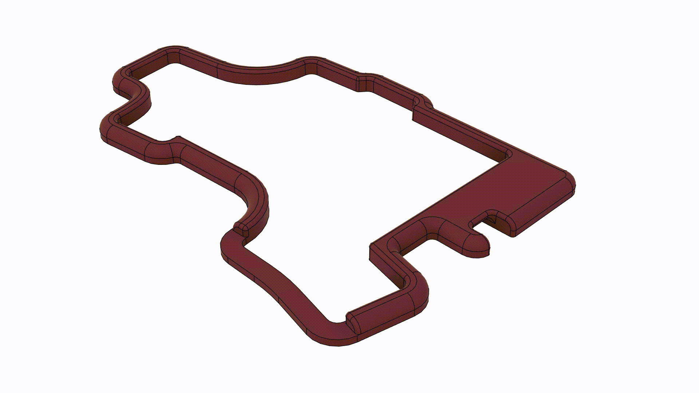

# PCB Assembly

Solder all components onto both the left and right hand side PCBs.
The microcontroller and USB-C connector are difficult to solder with a soldering iron.
The crystal oscillator must be soldered with a hot air station or oven.
The rest of the components can be soldered with a soldering iron, although there are a few 0402 components which can be a challenge.

Make sure to solder the diodes, crystal oscillator and microcontroller in the correct orientation!

PCB manufacturing outlets often provide an assembly service for an extra fee.

# Mechanical Assembly

Before assembling the keyboard, make sure the correct bootloader has been loaded!

The case is designed to be 3D printed on an FDM printer without supports.
I printed mine on my stock Creality Ender 3 V2.

1. 3D print *top.step*, *bottom.step* and *plate.step* from the `/mechanical` folder.
2. Push fit the threaded inserts into the holes on the bottom of *top.step*.
   This is best done by heating up the threaded inserts with a soldering iron before pushing them into position.
3. Clip the switches into their places on the top side of *plate.step*.
   There is only one way in which they will clip into place.
   The bottom side of *plate.step* has ridges onto which the switches clip.
4. With the PCB on the bottom side of *plate.step*, push the switches into their hot-swap sockets.
5. Sandwich *plate.step* in between *bottom.step* and *top.step*.
6. Screw in the screws from the bottom of the keyboard into the threaded inserts.
7. Stick on a rubber foot in each of the circular dents on the bottom of *bottom.step*.
8. Mirror the files in step 1, and repeat steps 2 to 7 for the right half of the keyboard.

## Threaded Insert Assembly

## Final Assembly

